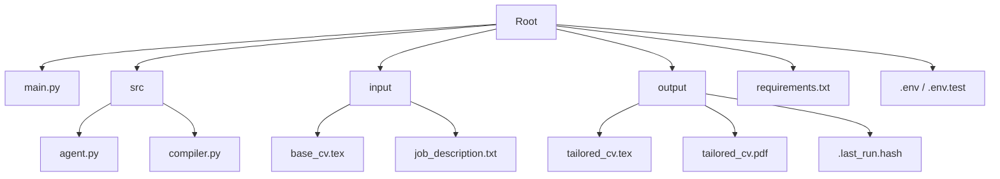

# Project Management Guide for **Job_hunting**

---
## Table of Contents
- [Overview](#overview)
- [Prerequisites](#prerequisites)
- [Repository Layout](#repository-layout)
- [Setup & Installation](#setup--installation)
- [Running the Application](#running-the-application)
- [Testing & Validation](#testing--validation)
- [Common Modification Patterns](#common-modification-patterns)
- [Debugging & Troubleshooting](#debugging--troubleshooting)
- [FAQ for LLM‑Based Edits](#faq-for-llm‑based-edits)

---
## Overview
`Job_hunting` is a Python‑based utility that adapts a LaTeX CV to a specific job description using the Gemini LLM. It consists of:
- **`app.py`** – Streamlit web interface with drag-and-drop / paste inputs and output mode toggle (PDF vs LaTeX only).
- **`run_app.bat`** – One-click launcher for Windows non-technical users.
- **`main.py`** – CLI entry point, handles argument parsing, caching, and PDF compilation.
- **`src/agent.py`** – LLM orchestration (analysis + LaTeX rewriting).
- **`src/compiler.py`** – Thin wrapper around the `tectonic` LaTeX compiler.
- **`input/`** – Place the base CV (`base_cv.tex`) and the job description (`job_description.txt`).
- **`output/`** – Generated `tailored_cv.tex`, compiled PDF, and a hash file for cache control.

---
## Prerequisites
| Tool | Version | Why it’s needed |
|------|---------|----------------|
| Python | >=3.10 | Core runtime |
| pip | latest | Package manager |
| **Google Gemini API key** (`GEMINI_API_KEY`) | – | Authenticates LLM calls |
| **tectonic** (bundled as `tectonic.exe`) | 0.x | Compiles LaTeX → PDF |
| **Visual C++ Redistributable x64** | latest | Required by `tectonic.exe` on Windows |
| (Optional) **virtualenv** or **conda** | – | Isolate dependencies |

---
## Repository Layout


---
## Setup & Installation
1. **Clone the repo**
   ```powershell
   git clone <repo‑url> e:\projects\Job_hunting
   cd e:\projects\Job_hunting
   ```
2. **Create a virtual environment** (recommended)
   ```powershell
   python -m venv .venv
   .\.venv\Scripts\Activate.ps1
   ```
3. **Install Python dependencies**
   ```powershell
   pip install -r requirements.txt
   ```
4. **Install the LaTeX compiler** (tectonic)
   - Windows installer: https://github.com/tectonic-typesetting/tectonic/releases
   - Ensure `tectonic.exe` is in your `PATH` or place the binary in the project root (the repo already ships a copy).
5. **Configure the Gemini API key**
   - Create a `.env` file at the project root (or edit the existing one) with:
     ```
     GEMINI_API_KEY=YOUR_API_KEY_HERE
     ```
   - The script loads this automatically via `python-dotenv` (if installed).

---
## Running the Application
### Basic execution
```powershell
python main.py
``` 
- The script reads `input/base_cv.tex` and `input/job_description.txt`.
- It caches the hash of both inputs. Subsequent runs reuse the generated `tailored_cv.tex` unless the inputs change.

### Force regeneration
```powershell
python main.py --force
``` 
- Bypasses the cache and calls Gemini again.

### Expected output
- `output/tailored_cv.tex` – the adapted LaTeX source.
- `output/tailored_cv.pdf` – compiled PDF (generated by `tectonic`).
- `output/.last_run.hash` – cache marker.

---
## Testing & Validation
The project does not ship a test suite, but you can perform quick sanity checks:
1. **Validate input files** – ensure both `base_cv.tex` and `job_description.txt` contain at least 50 non‑whitespace characters.
2. **Run the CLI with `--force`** – observe that the LLM is called (network request) and that a new PDF appears.
3. **Check the hash file** – after a successful run, `output/.last_run.hash` should contain a SHA‑256 string.

---
## Common Modification Patterns
| Goal | Typical Files to Edit | Example Change |
|------|----------------------|----------------|
| Change LLM model | `src/agent.py` (default `gemini-3.6-flash`) | Update `modelo_por_defecto` argument or set `LLM_MODEL` env var. |
| Add a new PDF post‑process step | `src/compiler.py` (or create a wrapper) | Call `pdfcrop` after `tectonic` finishes. |
| Customize prompts | `src/agent.py` – `sys_instruction_1`, `prompt_analisis`, `sys_instruction_2`, `prompt_redactor` | Replace wording or add extra system instructions. |
| Switch to a different LaTeX engine | `src/compiler.py` | Replace `tectonic` command with `pdflatex` or `xelatex`. |
| Introduce unit tests | New `tests/` directory | Use `pytest` to mock `genai.Client` and validate prompt construction. |

---
## Debugging & Troubleshooting
1. **Missing API key** – The script exits with `ValueError: Falta GEMINI_API_KEY`. Verify `.env` or the environment variable.
2. **Input validation errors** – Lines 24‑33 in `main.py` raise `FileNotFoundError` or `ValueError` if files are absent or too short.
3. **LLM call failures** – Look at the traceback printed in the `except Exception` block (lines 94‑96).
4. **LaTeX compilation errors** – `tectonic` prints its own diagnostics; check `output/` for a `.log` file if the PDF is not created.
5. **Cache not updating** – Ensure you either modify the input files or use `--force`.

---
## FAQ for LLM‑Based Edits
- **How should I reference a file in a prompt?** Use absolute or relative paths (e.g., `input/base_cv.tex`). The agent reads the file directly, so the path must be accessible from the current working directory.
- **Can I change the temperature?** Yes – edit `types.GenerateContentConfig(temperature=…)` in `src/agent.py` (lines 71 and 104).
- **What if I want to keep the preamble but still let the LLM see it?** Remove the `separar_latex` call in `generar_cv_adaptado` and adjust the prompts accordingly.
- **Is it safe to run the script without a `.env` file?** The script silently skips loading `.env` if `python‑dotenv` is missing; you must still provide `GEMINI_API_KEY` via the environment.
- **How does the cache work?** A SHA‑256 hash of the two input files is stored in `output/.last_run.hash`. The hash is recomputed each run; if it matches the stored value, the LLM call is skipped.

---
## Quick Reference Commands
| Action | Command |
|--------|---------|
| Install deps | `pip install -r requirements.txt` |
| Launch Web UI (Windows double-click) | Double-click `run_app.bat` |
| Launch Web UI (Terminal) | `streamlit run app.py` |
| Run CLI normally | `python main.py` |
| CLI Force regeneration | `python main.py --force` |
| Re‑install tectonic (Windows) | Download the exe from the releases page and place it in the repo root or add to `PATH` |
| Clean output (remove generated files) | `Remove-Item output\* -Recurse -Force` |

---
*End of guide.*
